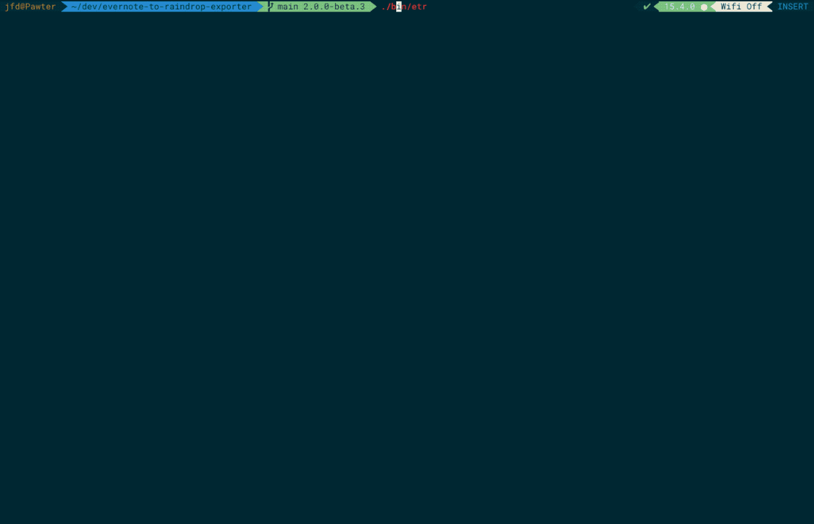
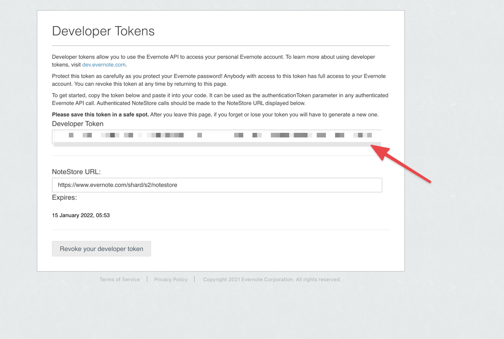
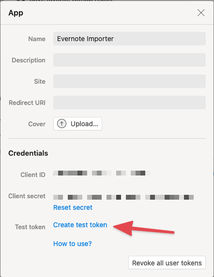
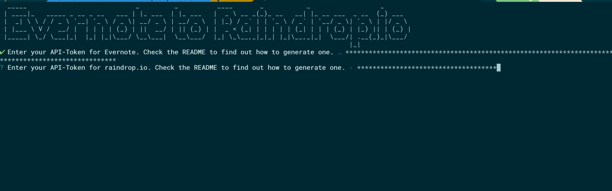
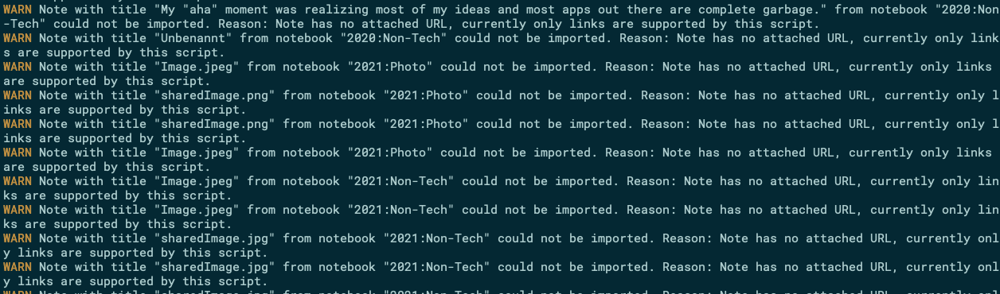
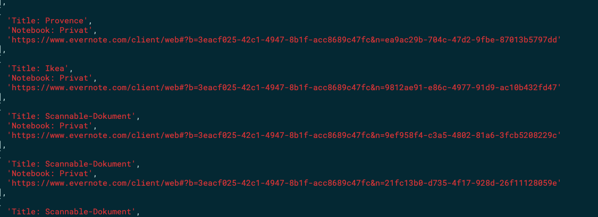

# ⛳️ Evernote to Raindrop.io Exporter

Export your [Evernote](https://evernote.com)-Notes that contain a url (usually added by the Evernote Webclipper) to [raindrop.io](https://raindrop.io).

## Highlights

- Exports all of your Evernote notes or notes from only specific notebooks or notes from stack of notebooks
- Migrates your notebook-structure to Raindrop collections
- Migrates all your tags
- Keeps the original date when your Evernote note was first created intact
- Should work with large datasets, I used it to import 13.000 notes

## How to run

### ☝️ Backup your data

Before you proceed please backup your data. This script has only been tested with my notes and my data and everything went fine, but due to this I cannot guarantee that you will like the end-result. So please make sure that you can revert the changes.

To backup your data go to the backup-tab in raindrops-settings: https://app.raindrop.io/settings/backups and choose one of the options there.

### 🧐 Generate API-Tokens

This script uses the Evernote and Raindrop APIs, so you will need to create an API-Token for both applications. You will be asked for the tokens when you first open the app. You only need to do this once.

#### Evernote

The most up-to-date information can probably be found in the [Evernote Documentation](https://dev.evernote.com/doc/articles/dev_tokens.php)

These are the general steps:

1. Go to https://www.evernote.com/api/DeveloperToken.action
2. Click "Create developer token"
3. Copy the token and keep it around until the importer prompts you for it

#### Raindrop.io

1. Go to https://app.raindrop.io/settings/integrations
2. Under "For Developers", click "Create new app"
3. Provide a name of your choosing, eg. "Evernote Import"
4. Accept the terms and click "Create"
5. Click on your newly created app, an overlay opens
6. Click "Create test token"
7. The combination of number and letters that appears after a moment is the token. Copy it and keep it around until you are asked for it.

### 💯 Install and run the app

For all other platforms or if you want to compile yourself:

0. Make sure you have at least node >= 14
1. Clone this repository
2. `npm install`
3. `npm start`

#### Choosing Options

You will be prompted for the developer tokens. Afterwards you can select what you want to import into raindrop.io:

It worked when your evernote notebooks could be successfully loaded.

#### 🚨 Whats up with all the warnings?

Warnings like this might appear during the import process.

**Explanation:** It is likely that you do not only have links in the notebooks you selected. This is for example true for every note you just used to write some text down, or if you uploaded a PDF. These notes cannot be imported into Raindrop because it is not a notetaking app. Only notes that have links attached will be imported. This is most commonly true for notes that were created by using the Evernote Web Clipper.

### 🤕 Restore a backup

You can import the html-file you saved when you backed up the data at: https://app.raindrop.io/settings/import

## Limitations

- Migrates only notes that have urls attached (usually created with the great Evernote Web-Clipper on Desktop or Mobile). So it is currently not possible to import urls that contain PDFs or Images, even though Raindrop would theoretically support those.
- Will not check during import if links already exist in raindrop (but raindrop will mark them as duplicates).
- Will not check during import if links are broken. Raindrop will mark them as broken, but if the content is not available anymore you will not have the content available there, even though you still see it in Evernote.
- Only tested on Mac. Binary only provided on Mac (because I have no Windows or Linux Systems to test on)
